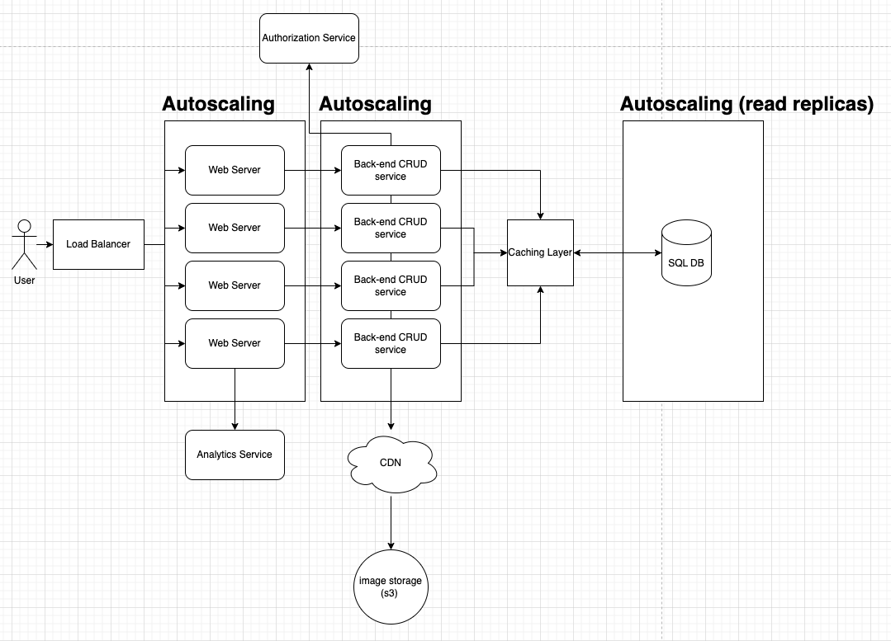
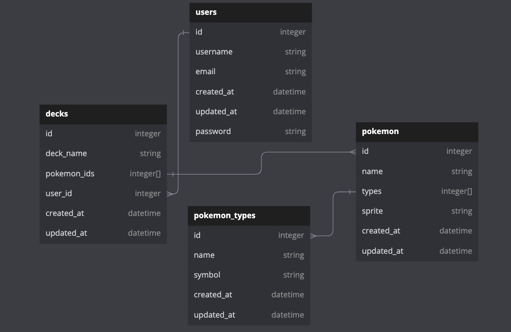
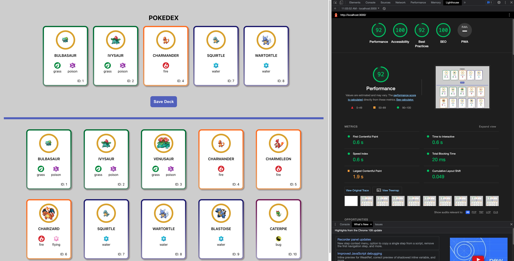

# Design Documentation

- In order to build a resilient and scalable web app, I would suggest architecting the app as follows. I'll speak more about each section in the notes below.

## CRUD service

- A back-end service that provides standard CRUD endpoints for the front-end web app to interact with. Users will need to be able to:
   - add/edit/remove pokemon cards in their deck
   - add/edit/delete their decks
   - search for a specific pokemon ( the pokedex could get massive! )
   - add/edit/delete pokemon cards
      - assuming that the pokedex is the deck of cards available to the player and not all of the pokemon that exist.
      - if so, we'd need to add an endpoint where users can submit an image to verify that they have a card in their possession. 

   - if players can create custom cards, the back-end will need to be able to upload images to the s3 bucket or other storage, and get a url in response that can be saved in the database.

   - Authorization is handled by an outside service like auth0 or SSO through google. The CRUD service would communicate with the authorization service and get a JWT token given valid credentials, and would respond to the front-end with that token, which would be saved in browser storage. 

### Monolith vs Microservices

- I don't see the need for a microservice architecture with this application because everything is tightly coupled. If the application or requirements were to get more complex, potentially branching out into a microservice architecture might make sense.

## Storage

> User can build several decks, up to 10 total, each with up to 5 cards

> User needs to be able to save the deck for future use beyond the current session

- A database would be ideal in order for a user to store different decks. The data is highly structured, and can easily be modeled with a few tables, as such I would recommend a relational database, like PostgreSQL. A SQL database, while sometimes being less performant than NoSQL databases, offers strong consistency and support transactions, which would be necessary, seeing as swapping even a single pokemon out of your deck could make or break your next match.

### Notes

- While I stored the entire pokemon blob in browser storage for the purposes of this assignment. I would opt to store just the pokemon IDs for a deck in a production solution. When a user would load their deck, the front-end would receive a list of IDs and then make a series of requests ( or a single request in an optimal/graphQL solution ) to fetch more detailed information about the pokemon in their deck, such as name, sprite, etc. There are tradeoffs with this approach. 

   - The benefit would be faster initial page load time, and more efficient storage in our database.
   - The cost would be a slight load time for the user when they select a deck to load up. 

## User Analytics

> We want metrics on how users are using our product

- An analytics tool like google analytics, or mixPanel, alongside the data we're storing in our database can be used to gather metrics around how our users are using the app. The web server would publish events to the analytics tool, without the need to go through the back-end. The following are events that I would consider tracking:
   - a card was added or removed from a deck
   - what pokemon was swapped out for what was swapped in
   - how often are players are renaming their decks
   - how long do they spend on the page

### Front-end performance metrics
- On top of user analytics, I would gather metrics around the following through the above-mentioned tools:
   - website performance metrics
      - First Contentful Paint
      - Time to Interactive
      - First Input delay
      - Cumulative Layout Shift
         - this one is especially important for accessiblity reasons. I've done my best in my 4 hours working on this project to avoid shifting the page around when the user has cards selected vs when they do not. Large content shifts can be disorienting to some users, and its best to avoid this as much as possible.

### Back-end performance metrics
   - monitoring and latency around endpoints can be done through tools like newRelic or DataDog. This is less about how our users are using the product and more to do with performance, but gathering these metrics would be useful.

### Accessibility metrics
- I would run frequent scans using browser tools like lighthouse to ensure my web app is accessible. I took the opportunity to do so with the assignment. For the scaled build, of course I would use something like AudioEye ;).

## Scalability

- As our incredibly well-designed app gains popularity, we'll need to ensure that load times remain low. To achieve this we'll need to implement things like a load balancer, which would balance out requests for authentication, deck management, and data storage. The load balancer would sit in front of the web server, and would receive incoming requests and distribute those requests to one of many web servers, hosting identical versions of the web app. 

- Background processing could also be useful, where a queue like AWS SQS is used to perform writes to the database at a later time depending on queue size. Depending on how the app is used, saving a pokemon to a deck may not be an immediate requirement. For instance, if optimistic UI is sufficient for our requirements.

### Reducing Load

- There could be some incredibly quick and easy wins here with caching. Given that there are typically stronger / more popular pokemon, people are bound to have favorites. Creating a caching layer, like Redis, that sits between the back-end and the database would be vital to reduce load. Whole pokemon records could be stored in the cache, and we could avoid hits on the database when the front-end makes requests for specific pokemon by ID. We could store the 100 most popular pokemon, eliminating those that aren't seeing any action at the moment, and continuously bumping those that are more popular to the top.

### Hosting Images

> We need a place to host images

- a CDN, like AWS CloudFront, would be vital here to ensure fast delivery of images across the globe. This could naturally integrate with other AWS tools like AWS s3 buckets, ensuring easy storage and management.
